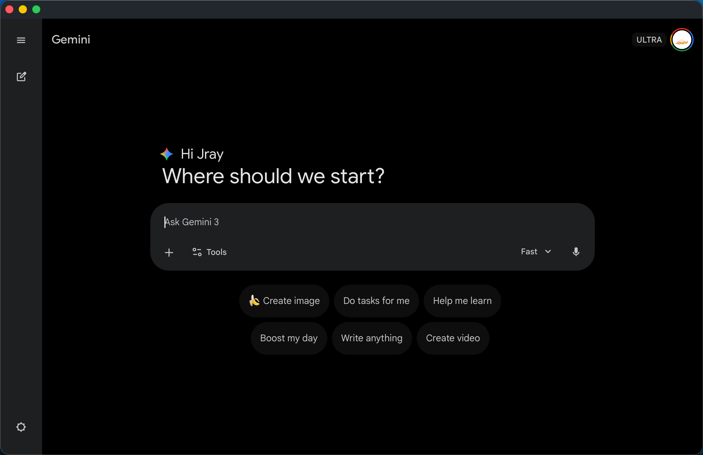
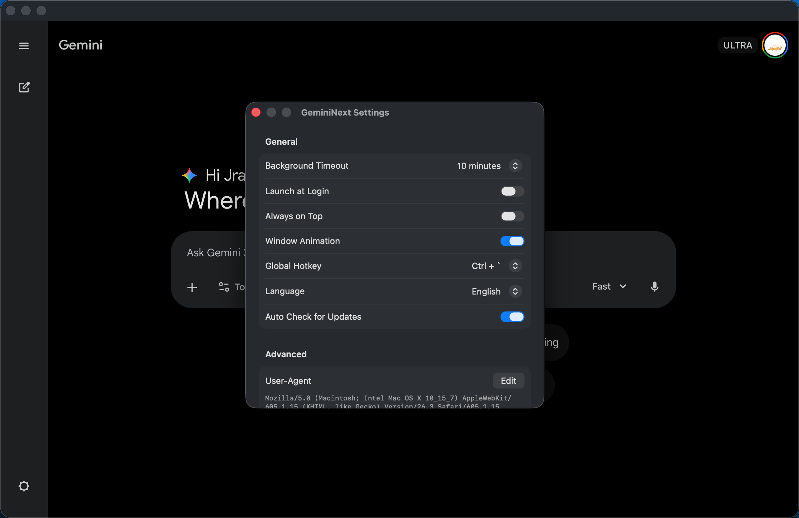

# GeminiNext

<div align="center">
  

  <h3>A lighter, cleaner, and more macOS-native unofficial Gemini desktop client</h3>
  
  <p>
    
     
    <a href="https://github.com/Jraaay/GeminiNext/releases">
      
    </a>
  </p>

  <p>
    <a href="./README_CN.md">简体中文</a> |
    <strong>English</strong>
  </p>
</div>

## 🎬 Demo

<div align="center">
  
</div>

## 📸 Screenshots

<div align="center">
  <p><strong>Main Interface</strong></p>
  
  <br><br>
  <p><strong>Settings</strong></p>
  
</div>

## 💡 Why GeminiNext?

Unlike bloated Electron-based apps, GeminiNext is built entirely with native SwiftUI. No excessive memory usage, no sluggish startup — just a silky-smooth experience that feels like a built-in macOS app.

### 🚀 Key Advantages

- **Blazing Fast** — No Electron runtime. Ultra-low memory footprint. Instant launch.
- **Seamless Integration** — Global hotkey + always-on-top window keeps AI at your fingertips.
- **Focused Experience** — Auto-focus input, flawless macOS IME support. No more web-based interaction lag.

## ✨ Features

### 🖥️ Deep System Integration

- **Global Hotkey** — Toggle the window with <kbd>Ctrl</kbd> + <kbd>&#96;</kbd> (customizable).
- **Launch at Login** — Start automatically when you log in.
- **Persistent Session** — Secure cookie storage means you never need to log in again.

### ⚡ Productivity Boost

- **Always on Top** — Pin the window above all others.
- **Timeout Reset** — Automatically starts a new conversation after prolonged inactivity.
- **Auto Focus** — Input field is focused whenever the window is activated.
- **Window Animation** — Smooth fade-in/fade-out transitions when showing/hiding the window.

### 🔄 Auto Updates

- **Sparkle Integration** — Built-in automatic update checking via the Sparkle framework.
- **Update Toggle** — Option to disable automatic update checks.

### 🛠️ Advanced Customization

- **Multi-language** — Native multi-language UI that follows your system language.
- **Custom User-Agent** — Flexible browser identity configuration.
- **Native Rendering** — Powered by the efficient WKWebView engine.

## 📦 Installation

### Option 1: Direct Download (Recommended)

Head to [Releases](https://github.com/Jraaay/GeminiNext/releases) and download the Universal Binary installer:

* `GeminiNext-vX.X.X.dmg` — supports both Apple Silicon and Intel Macs

### Option 2: Build from Source

To compile from source, make sure your environment meets: **macOS 14.0+** with **Xcode 16.0+** installed.

```bash
git clone https://github.com/Jraaay/GeminiNext.git
cd GeminiNext
open GeminiNext.xcodeproj
```

Select your target device in Xcode, then press `Cmd + R` to build and run.

## ⌨️ Keyboard Shortcuts

| Shortcut                       | Action                                   |
| ------------------------------ | ---------------------------------------- |
| <kbd>Ctrl</kbd> + <kbd>`</kbd> | Toggle window (customizable in Settings) |
| <kbd>Cmd</kbd> + <kbd>R</kbd>  | Reload page                              |
| <kbd>Cmd</kbd> + <kbd>[</kbd>  | Go back                                  |
| <kbd>Cmd</kbd> + <kbd>]</kbd>  | Go forward                               |
| <kbd>Cmd</kbd> + <kbd>W</kbd>  | Hide window                              |
| <kbd>Cmd</kbd> + <kbd>,</kbd>  | Open Settings                            |

## ⚙️ Settings

| Option             | Description                     | Default                        |
| ------------------ | ------------------------------- | ------------------------------ |
| Background Timeout | Start a new chat after timeout  | 10 min                         |
| Launch at Login    | Auto-start on login             | Off                            |
| Always on Top      | Keep window in front            | Off                            |
| Window Animation   | Fade transition on show/hide    | On                             |
| Global Hotkey      | Toggle window shortcut          | <kbd>Ctrl</kbd> + <kbd>`</kbd> |
| Language           | UI display language             | System                         |
| User-Agent         | Custom browser identity         | Safari UA                      |
| Auto Update Check  | Check for updates automatically | On                             |

## 🛠️ Tech Stack

* **SwiftUI** — Modern declarative UI framework
* **WKWebView** — High-performance web rendering engine
* **Carbon Events** — Low-level global hotkey registration
* **Sparkle** — Mature open-source framework for macOS app updates
* **String Catalog** — Apple's recommended localization solution

## 📄 License

This project is licensed under the [MIT License](./LICENSE).
